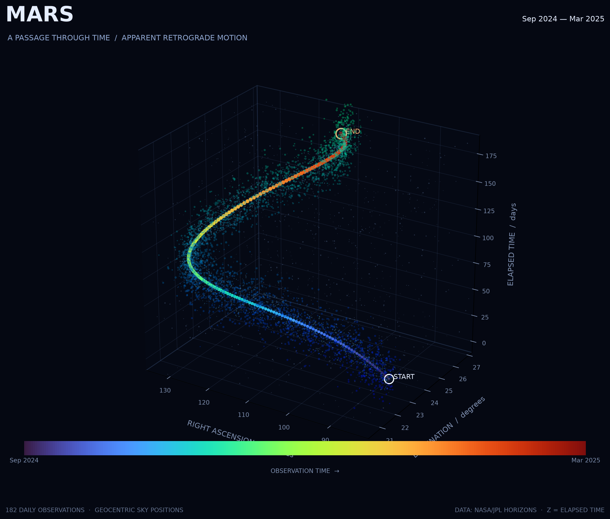
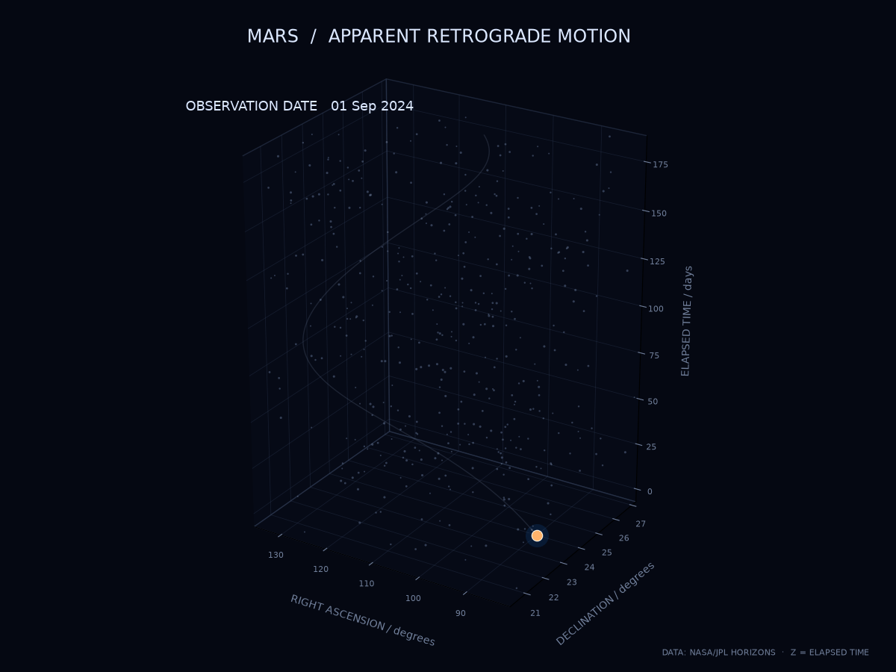

# Mars Retrograde Motion



*An animated view of the apparent motion of Mars:*



## The phenomenon

Mars retrograde motion is an apparent change in the direction of Mars across the night sky. Usually, Mars appears to move eastward relative to the background stars. However, during a certain period, it appears to move backwards before returning to its usual direction. This does not mean that Mars actually reverses its orbit. It is an effect caused by the different orbital speeds and distances of Earth and Mars as they travel around the Sun.

I chose this phenomenon because it shows how the motion of a planet can look different from Earth's point of view. I wanted to use real astronomical data to turn this movement into a visual image and make the changing path easier to see.

## The source

The data comes from NASA/JPL's Horizons System: https://ssd.jpl.nasa.gov/horizons/app.html#/. I selected Mars (499), observed from the geocentric position, from 1 September 2024 to 1 March 2025, with a time step of one day.

The original file, `horizons_results.txt`, contains 182 daily observations. Each data row represents Mars's apparent position at a specific date and time. The file records right ascension (RA) in hours, minutes and seconds, and declination (Dec) in degrees, arcminutes and arcseconds. The original data is stored in the `data/` folder and is used locally by the plotting scripts.

## What the picture shows

The visualisation uses the recorded positions of Mars to show how its apparent position changes over time. The observations are plotted in date order to reveal the path traced across the sky. The static image presents this path in 3D, while the animation reveals the observations one by one.

To make the data suitable for plotting, the RA and Dec values are converted from their original formats into numerical degrees. The Z-axis represents the elapsed time in days since the first observation. It is used to separate observations across time, rather than to represent Mars's actual distance or physical position in space. The stars and particles are visual elements that help show the path; they are not additional astronomical observations.

The picture highlights the apparent movement of Mars from Earth's point of view. It does not show the actual three-dimensional orbits of Earth and Mars, their changing distance, or a scientifically accurate star field. The visualisation therefore makes the pattern of apparent motion easier to see, while leaving out much of the wider astronomical context.

## Run it

Generate the static image:

```bash
uv run plot.py
