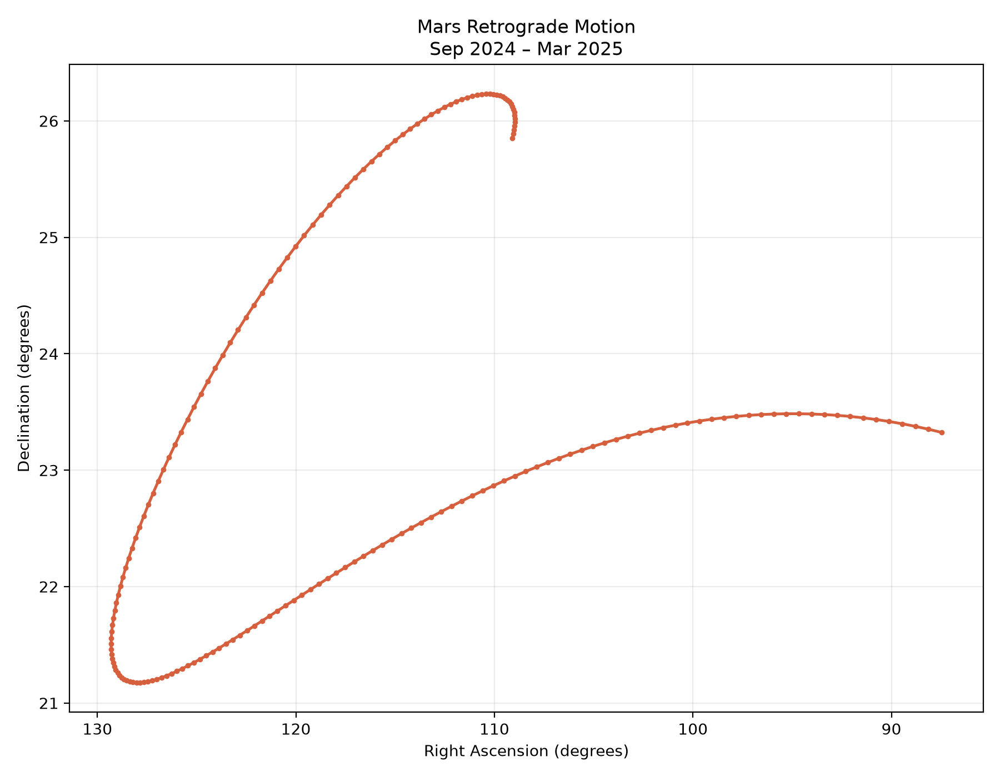

# Mars Retrograde Motion



## The phenomenon

Mars retrograde motion is an apparent change in the direction of Mars across the night sky. Usually, Mars appears to move eastward relative to the background stars. However, during a certain period, it appears to move backwards before returning to its usual direction. This does not mean that Mars actually reverses its orbit. It is an effect caused by the different orbital speeds and distances of Earth and Mars as they travel around the Sun.

I chose this phenomenon because it shows how the motion of a planet can look different from Earth's point of view. I wanted to use real astronomical data to turn this movement into a visual image and make the changing path easier to see.

## The source

<!-- A link to the page or endpoint the file came from, and one line on what is in
the file: how many rows, what a row means, what the units are. -->

## What the picture shows

<!-- Two or three sentences. Including what it hides: every transformation throws
something away, and naming what yours threw away is the easiest way to sound like
you know what you did. -->

## Run it

```
uv run fetch.py
uv run plot.py
```
